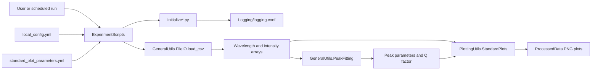

# RamanSpectroscopy architecture

## Scope

`RamanSpectroscopy` processes instrument-generated Raman CSV files. Its
pipeline loads wavelength and intensity arrays, optionally fits Gaussian peaks,
calculates quality factors, and writes standardized plots.

## Component flow

## Directory responsibilities

### `ExperimentScripts/`

Contains workflow-specific orchestration:

- `IntegrationTime.py` derives the integration-time experiment path but does
  not currently process files.
- `LensAlignment.py` loads spectra for excitation-lens alignment, fits their
  peaks, and creates intensity and quality-factor scatter plots.
- `ProcessSpecific.py` loads configured CSV files, creates raw-intensity plots,
  normalizes intensity by integration time, and creates normalized plots.
- `InitializeScripts.py` adds `RamanSpectroscopy` to the import path and
  configures project logging.

The scripts read `RAMAN_DATA_ROOT` from the ignored root `local_config.yml`.
Their input and output subdirectories are specific to each experiment.

### `GeneralUtils/`

`FileIO.py` reads the instrument CSV layout. It skips the first 32 header rows
and the final footer row, returning wavelength and intensity as one-dimensional
NumPy arrays.

`PeakFitting.py` provides Gaussian fitting, Gaussian curve evaluation, RMSE,
and Q-factor calculation. A Q factor is calculated from the fitted peak centre
and Gaussian full width at half maximum.

`InitializeGeneralUtils.py` configures the shared logging file and makes the
project utilities importable when run as a script.

### `PlottingUtils/`

`StandardPlots.py` provides the shared plotting surface:

- `line_plot()` creates a labeled Matplotlib line plot from named data series.
- `scatter_plot()` creates a scatter plot with optional error bars and a
  second-degree fit line.
- `cm_to_inches()` converts figure dimensions for Matplotlib.

`InitializePlottingUtils.py` configures logging and the plotting utility import
path.

### `Logging/`

Owns the Raman logging configuration and log cleanup command. Logs are written
to the console and to daily rotating `application_<date>.log` files. The
cleanup command retains files containing `ERROR`, `WARNING`, `FAILURE`, or
`FAILED` markers and supports `--dry-run` previewing.

## Configuration and data flow

1. A workflow reads `RAMAN_DATA_ROOT` from the repository-local
   `local_config.yml` (created from `local_config.example.yml`) and derives its
   experiment-specific input and output directories.
2. The script loads plotting defaults from the repository-local
   `standard_plot_parameters.yml` file.
3. `load_csv()` converts each supported instrument CSV into wavelength and
   intensity arrays.
4. `PeakFitting` calculates model parameters when a workflow requires fitted
   peaks.
5. `StandardPlots` writes raw, normalized, intensity, or quality-factor plots
   to the configured processed-data directory.

## Known incomplete areas

`IntegrationTime.py` currently derives its path without processing data.
Background subtraction in `ProcessSpecific.py` is currently commented out.
The experiment scripts depend on fixed, experiment-specific filenames and
directory layouts supplied by the local data environment. The project can be
cloned and run independently of the parent workspace.
